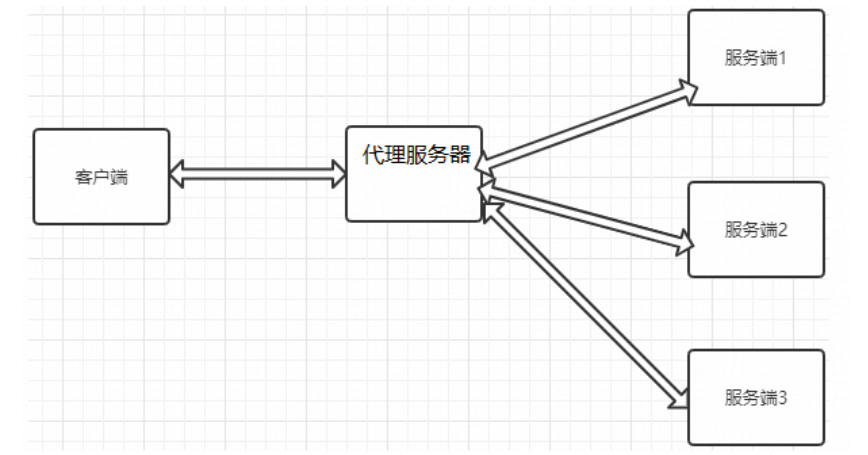
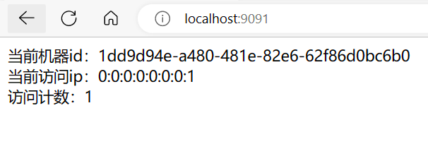
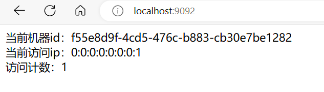
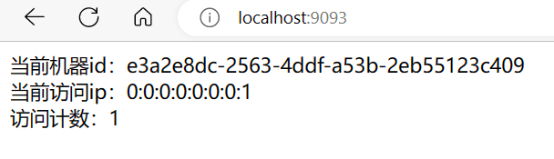
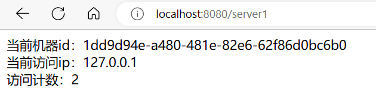
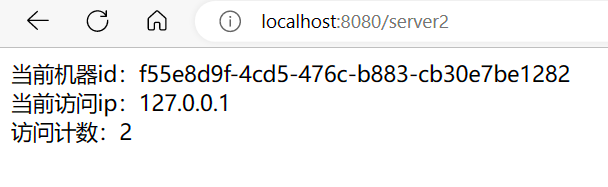
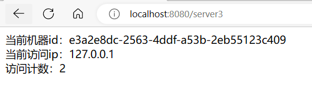

# Nginx反向代理

## 概述

反向代理服务器位于用户与目标服务器之间，但是对于用户而言，反向代理服务器就相当于目标服务器，即用户直接访问反向代理服务器就可以获得目标服务器的资源。同时，用户不需要知道目标服务器的地址，也无须在用户端作任何设定。反向代理服务器通常可用来作为Web加速，即使用反向代理作为Web服务器的前置机来降低网络和服务器的负载，提高访问效率

简而言之就是正向代理代理的对象是客户端，反向代理代理的是服务端

Nginx即可以实现正向代理，也可以实现反向代理。


## 反向代理的配置语法

Nginx反向代理模块的指令是由`ngx_http_proxy_module`模块进行解析，该模块在安装Nginx的时候已经自己加装到Nginx中了


### proxy_pass

该指令用来设置被代理服务器地址，可以是主机名称、IP地址加端口号形式。


|  语法  | proxy_pass URL; |
| :----: | :-------------: |
| 默认值 |        —        |
|  位置  |    location     |


* URL：要设置的被代理服务器地址。包含传输协议(`http`,`https://`)、主机名称或IP地址加端口号、URI等要素。


使用示例：

```sh
location /{
  proxy_pass http://192.168.200.146
}
```


### proxy_set_header

该指令可以更改Nginx服务器接收到的客户端请求的请求头信息，然后将新的请求头发送给代理的服务器


|  语法  |                proxy_set_header field value;                 |
| :----: | :----------------------------------------------------------: |
| 默认值 | proxy_set_header Host $proxy_host;<br/>proxy_set_header Connection close; |
|  位置  |                    http、server、location                    |


使用示例：

```sh
        location /server {
                proxy_pass http://192.168.200.146:8080/;
                proxy_set_header key value;
        }
```


### proxy_redirect

该指令是用来重置头信息中的"Location"和"Refresh"的值


|  语法  | proxy_redirect redirect replacement;<br/>proxy_redirect default;<br/>proxy_redirect off; |
| :----: | :----------------------------------------------------------: |
| 默认值 |                   proxy_redirect default;                    |
|  位置  |                    http、server、location                    |


* redirect：目标,Location的值
* replacement：要替换的值
* default：将location块的uri变量作为replacement，将proxy_pass变量作为redirect进行替换
* off：关闭功能


服务端[192.168.200.146]

```sh
server {
    listen  8081;
    server_name localhost;
    if (!-f $request_filename){
    	return 302 http://192.168.200.146;
    }
}
```


代理服务端[192.168.200.133]

```sh
server {
	listen  8081;
	server_name localhost;
	location / {
		proxy_pass http://192.168.200.146:8081/;
		proxy_redirect http://192.168.200.146 http://192.168.200.133;
	}
}
```


如果不使用proxy_redirect指令，服务端重定向时，会把服务端的真实ip地址发送到客户端（浏览器）


## 反向代理实现

### 需求

有三台服务器，服务器的内容不一样，要求访问/server1地址，访问的是服务器1的内容，访问/server2地址，访问的是服务器2的内容，访问/server3地址，访问的是服务器3的内容




### 实现

创建一个spring boot程序

* server1：端口为9091
* server2：端口为9092
* server3：端口为9093


程序的Controller如下：

```java
package mao.nginx_reverse_proxy_demo.controller;

import org.slf4j.Logger;
import org.slf4j.LoggerFactory;
import org.springframework.web.bind.annotation.GetMapping;
import org.springframework.web.bind.annotation.RestController;

import javax.servlet.http.HttpServletRequest;
import java.util.UUID;
import java.util.concurrent.atomic.AtomicLong;

/**
 * Project name(项目名称)：nginx-reverse-proxy-demo
 * Package(包名): mao.nginx_reverse_proxy_demo.controller
 * Class(类名): TestController
 * Author(作者）: mao
 * Author QQ：1296193245
 * GitHub：https://github.com/maomao124/
 * Date(创建日期)： 2023/5/10
 * Time(创建时间)： 13:44
 * Version(版本): 1.0
 * Description(描述)： 测试nginx反向代理
 */


@RestController
public class TestController
{
    /**
     * 日志
     */
    private static final Logger log = LoggerFactory.getLogger(TestController.class);

    private static final String UUID;

    private static final AtomicLong ATOMIC_LONG = new AtomicLong(0);

    static
    {
        UUID = java.util.UUID.randomUUID().toString();
        log.info("当前实例id为：" + UUID);
    }

    @GetMapping("/")
    public String ping(HttpServletRequest httpServletRequest)
    {
        long count = ATOMIC_LONG.incrementAndGet();
        String remoteAddr = httpServletRequest.getRemoteAddr();
        log.info(remoteAddr + "访问当前实例,访问计数：" + count);
        return "当前机器id：" + UUID + "<br>" + "当前访问ip：" + remoteAddr + "<br>访问计数：" + count;
    }
}
```


server2的启动命令：

```sh
java -jar nginx-reverse-proxy-demo-0.0.1-SNAPSHOT.jar --server.port=9092
```


server3的启动命令：

```sh
java -jar nginx-reverse-proxy-demo-0.0.1-SNAPSHOT.jar --server.port=9093
```


访问测试









配置代理服务器nginx.conf

```sh
#配置运行Nginx进程生成的worker进程数
worker_processes 2;
#配置Nginx服务器运行对错误日志存放的路径
error_log ./logs/error.log;
#配置Nginx服务器允许时记录Nginx的master进程的PID文件路径和名称
pid ./logs/nginx.pid;
#配置Nginx服务是否以守护进程方法启动
#daemon on;


events{
	#设置Nginx网络连接序列化
	accept_mutex on;
	#设置Nginx的worker进程是否可以同时接收多个请求
	multi_accept on;
	#设置Nginx的worker进程最大的连接数
	worker_connections 1024;
	#设置Nginx使用的事件驱动模型
	#use epoll;
}


http{
	#定义MIME-Type
	include mime.types;
	default_type application/octet-stream;
     

server {
        listen          8080;
        server_name     localhost;
        location /server1 {
                proxy_pass http://127.0.0.1:9091/;
        }
        location /server2 {
                proxy_pass http://127.0.0.1:9092/;
        }
        location /server3 {
                proxy_pass http://127.0.0.1:9093/;
        }
}
}
```


检查配置是否有错误：

```sh
PS D:\opensoft\nginx-1.24.0> nginx -t
nginx: the configuration file D:\opensoft\nginx-1.24.0/conf/nginx.conf syntax is ok
nginx: configuration file D:\opensoft\nginx-1.24.0/conf/nginx.conf test is successful
PS D:\opensoft\nginx-1.24.0>
```


启动nginx，访问8080端口


http://localhost:8080/server1




http://localhost:8080/server2



http://localhost:8080/server3




